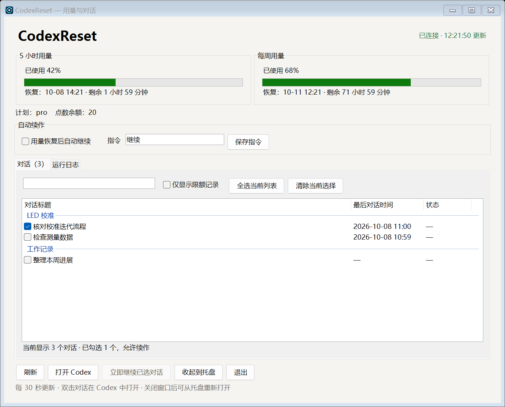

# CodexReset for Windows

Codex Desktop 的 Windows 辅助工具，基于 [boyso/codex-reset](https://github.com/boyso/codex-reset) 开发。它监控 Codex 用量，并在额度恢复后向用户选中的对话发送继续指令。本项目为非官方工具。

- 显示 5 小时和每周用量、恢复时间与倒计时。
- 按项目分组展示对话标题、最后对话时间和状态，支持搜索与勾选。
- 支持手动续作、自动续作和系统托盘后台运行。



*界面中的用量和对话为示例数据。*

## 安装

运行环境：Windows 10 / 11 x64，已安装 Codex 并登录账号。

下载本仓库源码，安装 .NET 8 SDK，然后在仓库根目录执行：

```powershell
powershell.exe -NoProfile -ExecutionPolicy Bypass -File .\build.ps1
```

生成后，双击 `publish\app\CodexReset.App.exe` 即可运行，无需额外安装 .NET Runtime。

## 使用

1. 打开程序，查看用量和对话列表。
2. 勾选需要续作的对话；双击对话可在 Codex 中打开。
3. 继续指令默认为 `继续`，修改后点击“保存指令”。
4. 点击“立即继续已选对话”进行手动续作，或勾选“用量恢复后自动继续”，等待额度恢复后自动续作。
5. 关闭窗口或点击“收起到托盘”后，程序继续后台运行；点击托盘图标可打开界面，选择“退出”可停止程序。

连接失败时，查看“运行日志”，点击“刷新”重试。
